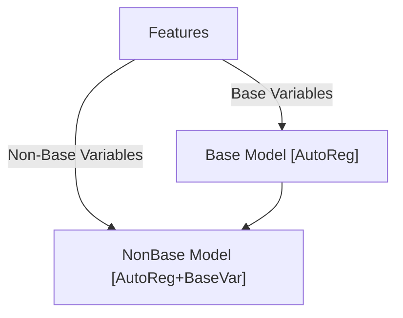
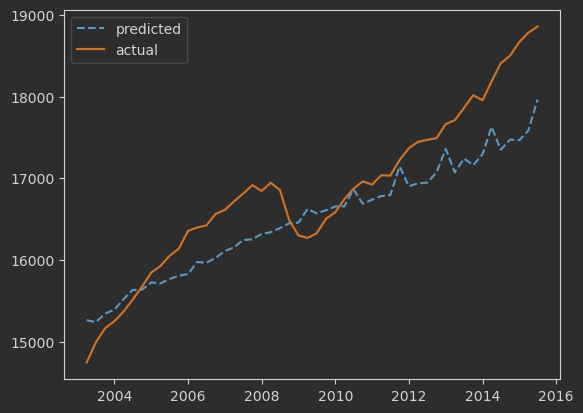

# MacroSim

MacroSim focuses on the derivation and iterative simulation of symbolic equations derived
through PySR's symbolic regression. This approach allows exploratory modelling of economic
indicators/variables without the restriction of adapting to predefined models. With a heavy emphasis on
mathematical interpretability, MacroSim is mainly geared towards research purposes. There's no question that
a well-implemented predictive regression model can produce more accurate predictions of an economy; However, when it
comes to exploring new economic models MacroSim is much better suited in comparison. Using real-world data to tune a
symbolic model creates the benefits of:

- Avoiding unrealistic assumptions (symbolic models based on real-world data do not require assumptions
  such as information symmetry, efficient markets, perfectly open or closed economies, etc.)
- Configurability of outputted expressions (The nature, complexity and constraints of equations are highly configurable)
- Freedom of modelling any variable as a function of others

MacroSim, being a simulation engine at its core, cannot rely on historical data in its core logic. Thus, accurately
modelling the growth, combined causality, and the extent of entropy in input variables is a crucial step for
producing satisfactory results. Symbolic regression ultimately produces an equation that generates an accurate output
if and only if the input variables themselves are accurate.

Fulfilling the requirement of accurate inputs in a simulation is tough. However, by a combination of causality analysis,
entropy (noise) generators, and symbolic growth modelling, we can create a feedback loop architecture built
on top of the variables that we can confidently predict through lagged features. The explained workflow is currently
under development and needs extensive testing/optimizations given the significant amount of symbolic searches
and statistical tests required in the feedback logic. Currently, `macrosim.GrowthDetector` uses a unary curve fitting
algorithm to classify the growth patterns of variables and optimize parameters to reflect the line of best fit.
Predictably, unary functions are not great at modelling the growth of economic variables and this logic was implemented
as a proof of concept in early stages of development.

## Example Usage

Production function modelling (I believe) can be one of the most common use cases for MacroSim, and it will be the
example of choice here.  Let's assume we're looking into modelling real GDP as a function of:

- Labor Participation Rate
- Real Imports
- Domestic Investment

### Data Retrieval

The first step would be to retrieve data for the above-mentioned metrics from FRED using `macrosim.SeriesAccessor`.

```python
from macrosim.SeriesAccessor import SeriesAccessor
import datetime as dt

fred = SeriesAccessor(
    key_path='../fred_key.env',
    key_name='FRED_KEY'
)

start = dt.datetime.fromisoformat('2002-01-01')
end = dt.datetime.fromisoformat('2024-01-01')

df = fred.get_series(
    series_ids=['CIVPART', 'IMPGSC1', 'GPDI', 'GDPC1'],
    series_alias=[None, 'RIMP', 'DOMINV', 'RGDP'],
    reindex_freq='QS',
    date_range=(start, end)
)
```

`reindex_freq='QS'` reformats all data to quarterly frequency, introducing `NaN` values if the original series is
updated less frequently. The reindexing operation matches the frequency of all variables to the target. (being real GDP)
We can deal with the `NaN` values, again, using `macrosim.SeriesAccessor`.

```python
df = fred.fill(
    data=df,
    methods=[None, None, None, None]
)
```

In the example, only none of the series had data that's less frequent than quarterly. In cases with NaNs after reindexing,
the fill method could be used as displayed. (refer to [MacroSim Docs](https://gongjr0.github.io/MacroSim/) for detailed information on available methods)
We now have a dataset free of `NaN`s and ready for symbolic regression

### Symbolic Regression

The symbolic regression backend of `MacroSim` relies on the `PySR` library which provides a regressor written
in julia, (a compiled language) and a python interface. `macrosim.EqSearch` is a class that takes the
`pysr.PySRRegressor` as its base and extends it by including model distillation and LOF outlier detection features.
(Reasons behind opting for distillation and LOF based outlier removal are discussed further below)

Having our dataset, we can conduct a symbolic search to derive the most accurate representation of real GDP within the
constraints that we define.

```python
from macrosim.EqSearch import EqSearch

eqsr = EqSearch(
    X=df.drop('RGDP', axis=1),
    y=df['RGDP']
)
eqsr.distil_split()
eqsr.search(maxsize=16, niterations=250, verbosity=1)
```

`EqSearch.distil_split` was called to filter out the outliers with LOF and distil the target variable through a Random
Forest regressor. The aggressive outlier handling implemented ensures that the symbolic regression will target a more
general scope instead of attempting to predict shocks at fit time. The following call to `EqSearch.search` initiates the
symbolic regression; no custom constraints were defined here, but you can refer to the [documentation](https://gongjr0.github.io/MacroSim/) for a detailed
explanation of how to set them. We now have the core component for our simulation engine, the main equation that will be
responsible for mapping our inputs to outputs. However, we are yet to explore the growth patterns of our input variables.
We need to define functions that will govern how our inputs evolve over $n$ steps of simulation.

### Input Growth Modelling [Proof of Concept!!]

`macrosim.GrowthDetector` is responsible for deriving growth functions for each input variable. The evolution of our
parameter space is is modelled as a fully endogenous system of equations derived through symbolic regression and robust
fallback methods to preserve accuracy. Features are split into the categories __Base__ and __Non-Base__ to define their
role within the feature space. Base variables are modelled as fully autoregressive and they create the backbone of the
growth function structure for non-base variables. The selection of base variables follow a 3-step evaluation logic
consisting of:

- Bivariate Granger Causality Test (Tests if lags of $x$ contain significant information for predicting $z$)
- Multivariate Granger Causality Test (Tests if lags of $(x,y)$ contain significant information for predicting $z$)
- Autoregressive suitability assesment (Augmented Dickey-Fuller test)

In the selection process, Granger Causality Tests (GCT) are used determine the most significant features in terms of
causality over the entire space. Since base variables serve as the foundation for modeling all non-base variables, selecting
variables with strong predictive relationships is an intuitive and necessary requirement However, causality alone is
not enough to confidently select base variables. We need to confirm that the variables selected are suitable for
autoregressive modelling since base variables modelled as a function of themselves. The Augmented Dickey-Fuller Test
(ADF) looks for a unit-root in variables to determine if they are stationary. A variable is defined to be stationary
if the mean, variance, and autocovariance are constant over time. For our purposes, we assume that stationary variables
are significantly better suited for autoregression due their relatively tame and predictable nature.

Growth modelling follows the flow depicted below:


`GrowthDetector` handles the selection and modelling through one function call and model configuration of base and non-base
variables are available through separate methods to pass the kwargs.

```python
from macrosim.GrowthDetector import GrowthDetector

gd = GrowthDetector(
    features=df.drop('RGDP', axis=1)
)
gd.base_estimator_kwargs(verbosity=0)
gd.non_base_estimator_kwargs(verbosity=0)

growth = gd.compose_estimators(cv=2)
```

`GrowthDetector.compose_estimators` returns a dictionary containing the fitted models for each variable.

### Simulating the derived scenario

The simulation engine is responsible for utilising the growth estimators along with the main eqation to simulate a given
scenario for the desired duration. On initialization, `macrosim.SimEngine` requires:
- Data for the first step of simulations
- Growth estimators of all variables
- Main equation modelling the target

Having given the above information, simulations of any desired length is theoretically possible. (although not recommended
due to error accumulation and drift)

```python
from macrosim.SimEngine import SimEngine

init_params = {
    var: (df[var].head(gd.get_lag_count), growth[var]) for var in df.drop('RGDP', axis=1).columns
}
engine = SimEngine(
    sr=eqsr.get_model,
    init_params=init_params,
    n_lags=gd.get_lag_count
)

out = engine.simulate(50)
```

`init_params` is set up such that the feature names are dict keys and for each key we have a `tuple[pd.Series, GrowthEstimator]`
value. We elected to initiate the simulations from the beginning point of the data in order to be able to compare the result
to the true values. We need $n$ lags of information to produce the first set of predictions and $n$ is a function of the size
of our dataset. `GrowthDetector.get_lag_count` allows us to dynamically retrieve enough data when constructing the initial
parameters.

when setting up the `SimEngine` object, we're required to pass the main regressor for the target variable estimations,
initial params, and `n_lags`. (`n_lags` is not inferred from the data in case there are errors with retrieval) Once all
arguments are passed, the last step is calling `SimEngine.simulate` with the amount of steps we wish to simulate. This 
will return a `pd.DataFrame` with values every feature and target at all steps. 

### A Peak at the Results

By plotting the simulated data against the real observations, we can check the performance. Due to insufficient accuracy
of growth functions (for now) accurate results are not expected. Plotting the simulation confirms this:

<p align="center">
  </img>
</p>

We can observe that the simulation results were relatively linear and flatter than the actual values. Another important 
note is that the simulations consistently underestimated the output, with the exception of the 2008 crisis. Until 2010,
the predictions did not display cyclical errors, but a clearly visible pattern appeared around 30 steps into the 50 step
simulation.

The coefficient of determination ($R^2$) for this particular example was $\approx 0.722$ which is definitely not upto 
standard, nor hopeless. With further development the accuracy of simulations (especially for shorter periods) will 
definitely increse.

## Comments
Although there's a lot of work to do, MacroSim is fully functional and relatively accurate. An important remark that 
wasn't shown in this document is the complexity of the equations. Even if we assumed that the current results are 
acceptable, the equations that produced them are not pretty. Similar results could've been produced with simpler equations
with the necessary optimizations and additions to the engine and model logic. `pysr.PySRRegressor` includes the 
functionality to fit a parametrized function rather than running a full discovery; we could explore fitting
parametrized functions that are robust and safe for non-base variables while keeping full scale searches for the main 
target and base variable models.