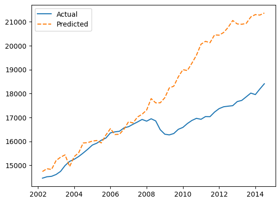

# MacroSim Documentation

MacroSim is a python library aimed at creating symbloic models of economic variables thgough PySR's 
`PySRRegressor`. It utilizes a FRED series accessor and a cunstomizable equation search engine to find an accurate 
smybolic representation of the selected variavle using the features retrieved from FRED series. MacroSim contains a 
simulation engine that has the capability to extrapolate the given data points using fully symbolic, per-variable growth 
rate equations.


MacroSim's main focus is not on producing the most accurate output, but to ensure explorability of outputs for research 
purposes. Both the symbolic regression results and the fitted growth equations prioritize interpretability. Although 
kinks are often produced in the output extrapolation process, the equations themselves are configured to be differenciable 
in most cases.


## Installation

MacroSim can be installed through `pip`; and the builds are available in the github repo if you prefer to install it 
manually. The pip command required to retireve MacroSim is:

```bash
python -m pip install macrosim
```

## Example Usage
Production function modelling (I believe) can be one of the most common use cases for MacroSim, and it will be the 
example of choice here.  Let's assume we're looking into modelling real GDP as a function of:

- Labor Participation Rate
- Capital Investment
- Net Exports
- CPI
- Population Growth
- Real Wage

### Data Retrieval
The first step would be to retrieve data for the above-mentioned metrics from FRED using `macrosim.SeriesAccessor`.
```python
from macrosim.SeriesAccessor import SeriesAccessor
import datetime as dt

fred = SeriesAccessor(
    key_path='../fred_key.env',
    key_name='FRED_KEY'
)

start = dt.datetime.fromisoformat('2002-01-01')
end = dt.datetime.fromisoformat('2024-01-01')

df = fred.get_series(
    series_ids = ['NETEXP', 'CIVPART', 'CORESTICKM159SFRBATL', 'LES1252881600Q', 'SPPOPGROWUSA', 'A264RX1A020NBEA', 'GDPC1'],
    series_alias=[None, None, 'CPI', 'RWAGE', 'POPGROWTH', 'I_C', 'RGDP'],
    reindex_freq='QS',
    date_range=(start, end),   
)
```
`reindex_freq='QS'` reformats all data to quarterly frequency, introducing `NaN` values if the original series is 
updated less frequently. The reindexing operation matches the frequency of all variables to the target. (being real GDP)
We can deal with the `NaN` values, again, using `macrosim.SeriesAccessor`.
```python
df = fred.fill(
    data=df,
    methods=[None, None, None, None, 'ffill', 'divide', None]
)
```
In the example, only 2 of the series had data that's less frequent than quarterly. Here, the elected built-in fill 
methods are specified in string literals. (refer to [MacroSim Docs](https://gongjr0.github.io/MacroSim/) for detailed information)
We now have a dataset free of `NaN`s and ready for symbolic regression

### Symbolic Regression
The symbolic regression backend of `MacroSim` relies on the `PySR` library which provides a regressor written 
in julia, (a compiled language) and a python interface. `macrosim.EqSearch` is a class that takes the 
`pysr.PySRRegressor` as its base and extends it by including model distillation and LOF outlier detection features.
(Reasons behind opting for distillation and LOF based outlier removal are discussed further below)

Having our dataset, we can conduct a symbolic search to derive the most accurate representation of real GDP within the
constraints that we define.

```python
from macrosim.EqSearch import EqSearch

eqsr = EqSearch(
    X= df.drop('RGDP', axis=1),
    y= df['RGDP']
)
eqsr.distil_split()
eqsr.search()

eq = eqsr.eq
```
`EqSearch.distil_split` was called to filter out the outliers with LOF and distil the target variable through a Random
Forest regressor. The aggressive outlier handling implemented ensures that the symbolic regression will target a more
general scope instead of attempting to predict shocks at fit time. The following call to `EqSearch.search` initiates the
symbolic regression; no constraints were defined here, but you can refer to the [documentation](https://gongjr0.github.io/MacroSim/) 
for a detailed explanation of how to set them. We now have the core component for our simulation engine, the main 
equation that will be responsible for mapping our inputs to outputs. However, we are yet to explore the growth patterns 
of our input variables. We need to define functions that will govern how our inputs evolve over $n$ steps of simulation.

### Input Growth Modelling [Proof of Concept!!]
`macrosim.GrowthDetector` is responsible for deriving growth functions for each input variable. Using the historical 
data we have, pre-defined parametrized growth functions are fitted to the data and the best fitting functions are 
selected for each variable on the basis of MSE.
```python
from macrosim.GrowthDetector import GrowthDetector

gd = GrowthDetector()
opt = gd.find_opt_growth(df.drop('RGDP', axis=1))
print(opt)
```
```
>>> {'NETEXP': (Logarithmic(x, 579.61, 0.0, 1.0, 170.21), MSE = 20050.11),
 'CIVPART': (Linear(x, -0.06), MSE = 0.38),
 'CPI': (Logarithmic(x, 1.85, 1.13, 1.0, 0.03), MSE = 1.22),
 'RWAGE': (Exponential(x, 1.0, 0.0), MSE = 119.37),
 'POPGROWTH': (Exponential(x, 1.02, -0.02), MSE = 0.02),
 'I_C': (Exponential(x, 1.02, -1.46), MSE = 409.61)}
```
We can see that `GrowthDetector.find_opt_growth` returns a dictionary of tuples. Index 0 of the tuples contain a function
with a custom `__repr__` method to signify the nature and parameters of the function that best describes the growth of said
variable. Index 1 contains the MSE value (`np.float64`) obtained at fit time. (again, with a formatted `__repr__` 
method) This gives us all we need to initiate the simulation.

### Simulating the derived scenario
The simulation engine is built as a non-exhaustible generator that will recursively apply the growth functions and derive
an output using the symbolic regression result.

```python
from macrosim.SimEngine import SimEngine

initial_params = {
    col: (df[col].iloc[0], opt[col][0]) for col in df.columns[:-1]
}

engine = SimEngine(
    eq=eq,
    init_params=initial_params,
    deterministic=True,
    entropy_coef=0.01
)

for _ in range(50):
    next(engine._simulate())

output_df = engine.get_history()
```
As the first step, we defined the initial values and growth functions that will govern them as a tuple for each column. 
will be inputted to the generator logic. We used the first index of our historical data (the most recent observations) to
be able to compare our results with the real observations. (We could've used the most recent observations to simulate
future periods.) Then, an instance of `macrosim.SimEngine` was declared with the necessary parameters. The chosen
entropy coefficient was 0.01 (this value defines the average extent of noise as a percentage of the variables) so we 
expect to see shocks (noise) that's 1% of the values computed by the growth functions in both positive and negative 
directions. Using `entropy_coef=0` will completely disable the noise and will allow a clean inspection of growth function
behavior.


### A Peak at the Results

By plotting the simulated data against the real observations, we can check the performance. Due to insufficient accuracy
of growth functions (for now) accurate results are not expected. Plotting the simulation confirms this:

<p align="center">
  </img>
</p>

We can see that the results were relatively accurate until the 2008 crisis. (it honestly performed better than I expected)
The growth functions are called recursively, and we used a minimal amount of randomized entropy. This meant that we didn't
stand a chance against a massive shock. The engine simply preserved the expected state as defined by the symbolic 
expressions.

## Comments
As seen in the example, the current state of MacroSim is not well suited for stochastic shocks. After the implementation
of more advanced growth modelling techniques, this issue will also be addressed. The current example showed that a 
symbolic regression and simulation pipeline has the power to (at the very least) preserve the state of an economy over time.
As improvements and additions are implemented, MacroSim can become a gateway to utilise a regression model that was built
for natural sciences and take it to the realm of economic simulation.